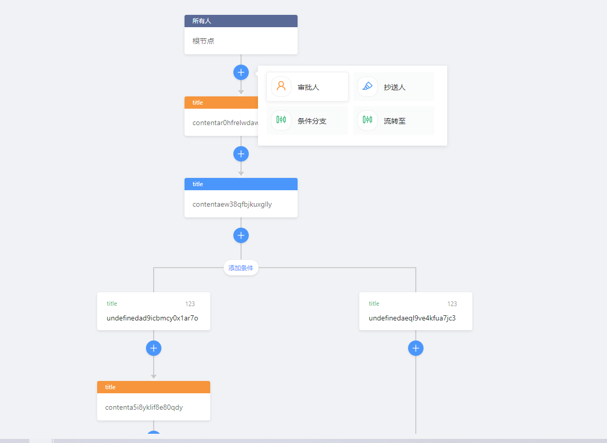

<!-- START doctoc generated TOC please keep comment here to allow auto update -->
<!-- DON'T EDIT THIS SECTION, INSTEAD RE-RUN doctoc TO UPDATE -->
**Table of Contents**  *generated with [DocToc](https://github.com/thlorenz/doctoc)*

- [仿钉钉自定义流程文档](#%E4%BB%BF%E9%92%89%E9%92%89%E8%87%AA%E5%AE%9A%E4%B9%89%E6%B5%81%E7%A8%8B%E6%96%87%E6%A1%A3)
  - [效果图](#%E6%95%88%E6%9E%9C%E5%9B%BE)
  - [使用方法](#%E4%BD%BF%E7%94%A8%E6%96%B9%E6%B3%95)
    - [Attributes](#attributes)
    - [Events](#events)
    - [方法](#%E6%96%B9%E6%B3%95)
    - [TreeNode](#treenode)

<!-- END doctoc generated TOC please keep comment here to allow auto update -->


# 仿钉钉自定义流程文档

## 效果图


## 使用方法
在需要的地方引入，例如全局引入 (main.js)
```javaScript
import DrawFlow from "./components/DrawFlow";
Vue.use(DrawFlow);
```
然后就使用它
```html
 <FactoryDrawFlow
      @clickNode="clickNode"
      ref="flow"
      :FlowConfig="FlowConfig"
    ></FactoryDrawFlow>
``` 
### Attributes 
| 参数       | 说明     | 类型       | 可选值 | 默认值 |
|------------|--------|------------|--------|--------|
| FlowConfig | 展示数据 | FlowConfig | --     | --     |
### Events

| 事件名称   | 说明   | 回调参数  
|------|------|------|
| clickNode | 点击流程节点时触发 | 返回当前节点数据（TreeNode）

### 方法

| 方法名称   | 说明   | 回调参数  
|------|------|------|
| getResData | 获取流程图数据 | 所有流程节点的一维数组集合
| nodeChange | 在自己业务页面操作完，当前节点发生变化时，可手动去触发 | 支持传入当前改变的节点，数据结构参考下文TreeNode

### TreeNode

| 参数     | 说明                                          | 类型            | 可选值                  | 默认值 |
|----------|---------------------------------------------|-----------------|-------------------------|--------|
| id       | 定位节点的唯一标识                            | string          | --                      | --     |
| groupId  | 流程图生成过程中生成的组id                    | string          | --                      | --     |
| type     | 节点类型                                      | string          | '1','2','3','4','5','6' | --     |
| title    | 标题                                          | string          | --                      | --     |
| groupPid | 流程图渲染过程中所应用数据                    | string          | --                      | --     |
| content  | 节点显示内容                                  | string          | --                      | --     |
| isRow    | 是否为行元素                                  | boolean         | --                      | --     |
| isRoot   | 是否为根节点                                  | boolean         | --                      | --     |
| data     | 拓展属性，用以存储业务相关内容                 | object          | --                      | {}     |
| pids     | 流程图生成过程中生成属性，指明此节点父节点数组 | Array<'string'> | --                      | --     |


